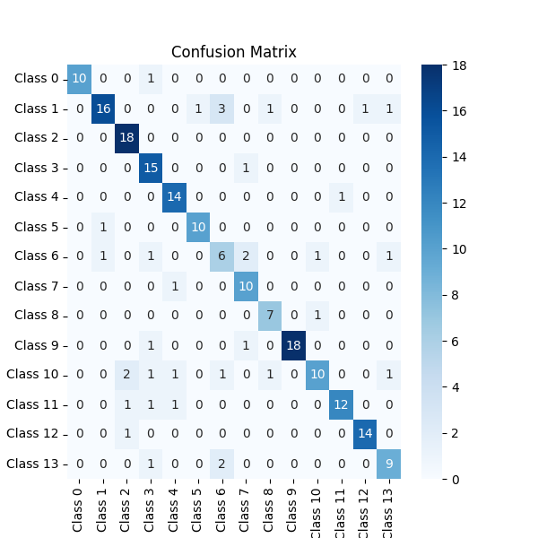

## Flower Classification

- classification 14 Face with Pytorch.

### Project Features:

- Use Transfer Learning with resnet 101.
- Use Data Augmentation.

### Results:

| Data       | Loss   | Accuracy |
|------------|--------|----------|
| Train      | 0.8463 | 0.8626   |
| Validation | 0.8491 | 0.8646   |
| Test       | 0.9067 | 0.84     |

### Dataset:

- Receive the data set in [Google Drive](https://drive.google.com/drive/u/0/folders/1WGSotRtFPYGuxPEGkWWRsBPlVXFSvl7p)
  from My Master [Mr. Sajjad Aemmi](https://github.com/sajjadAemmi/)